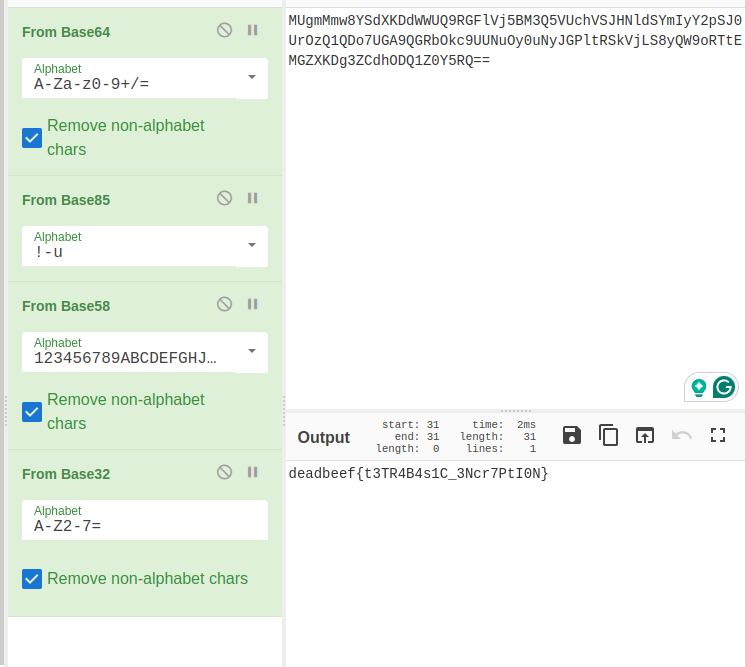

# Solve

Refer to the periodic table:
Ge, Ce, At, Gd. Look at their numbers.

-> 32, 58, 85, 64

The problem is literally called "Acids and Bases", so it's probably some base encryption.

Put it into cyberchef, and reverse the order of the bases (cuz decryption is the reverse of encryption)

Flag: deadbeef{t3TR4B4s1C_3Ncr7PtI0N}