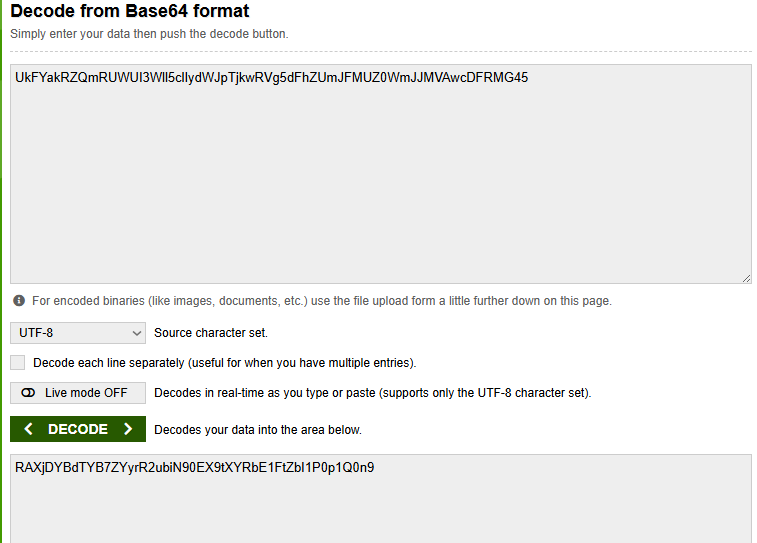
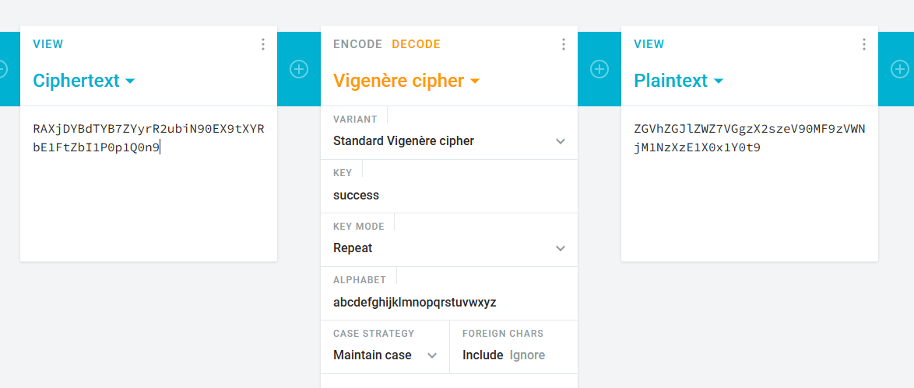
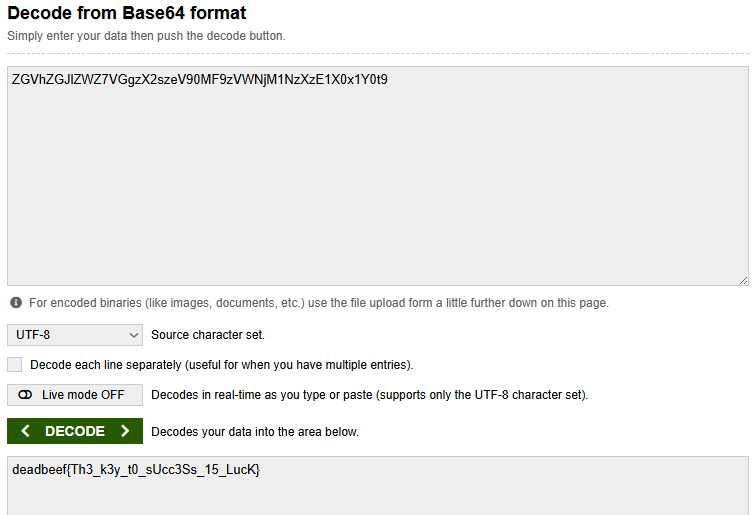

The question states that "Base-64 Sandwhich, with vinegar in the middle", implying that
You need to decode with b64, decode with vigenere cipher, then decode with b64 again
The vigenere flag is "success", as stated in the question

Flag: deadbeef{Th3_k3y_t0_sUcc3Ss_15_LucK}
