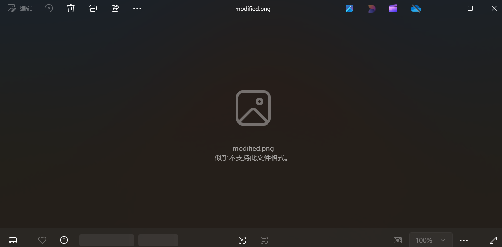
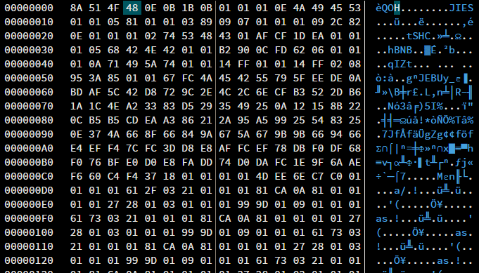
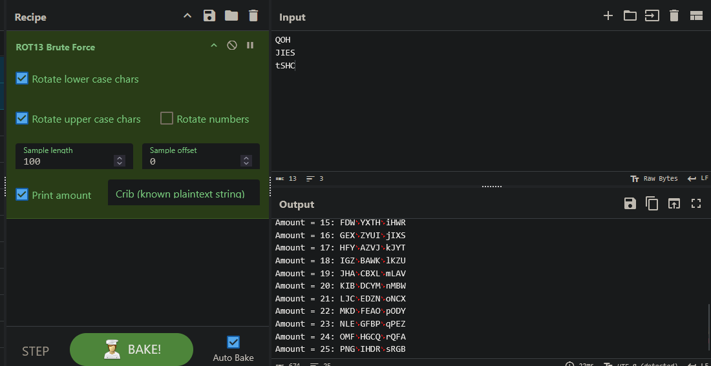
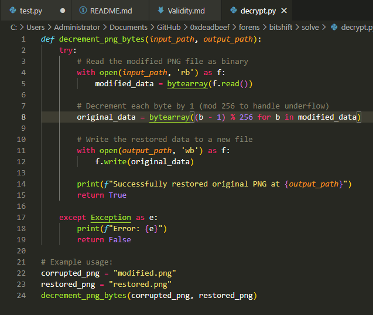
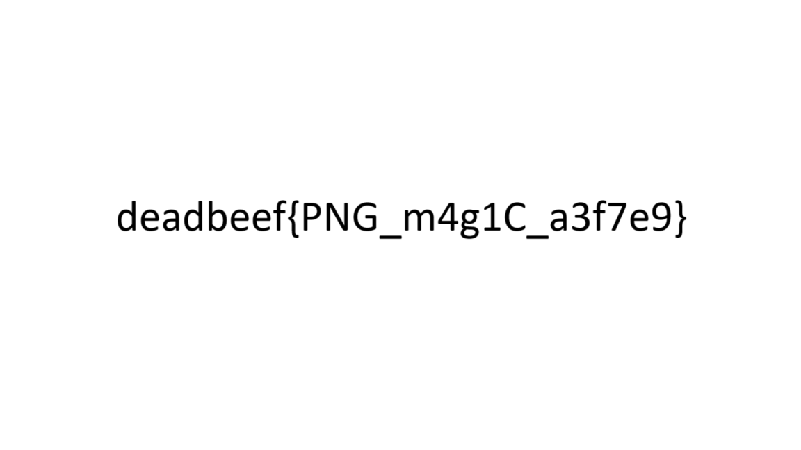

We are presented with a file modified.png

Image viewer also cannot process this file.
Hence, there are 2 possible conclusions:
1. This is not a valid png file
2. This is a corrupted png file
To confirm this, we use a hex editor to view the file.

We can see the following strings:
QOH
JIES
tSHC
The overall file structure is very similar to a png file, maybe the data is encrypted somehow?

From this, we can tell that all letters are shifted forward by one. 
Hence, from this we can infer that all bytes in the file are incremented by 1
Therefore, we can write a program to reverse this encryption.

using deepseek, we can write a simple program that reverses this encryption, and we get

NOTE: decrypt.py is provided as a sample program that reverses the encryption
encrypt.py does the reverse

